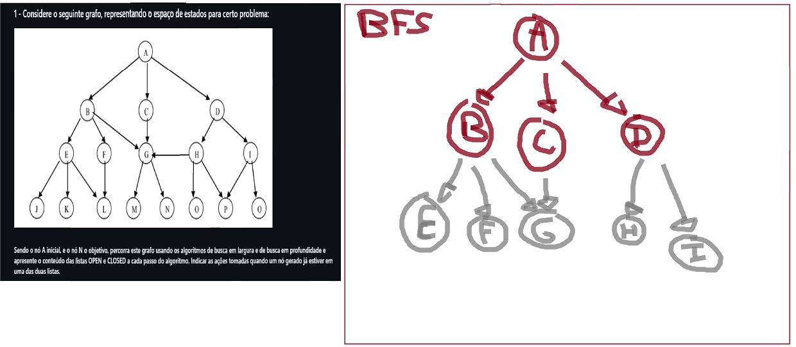

# Resolução de Problemas por Busca Desinformada

### Questão 1:

#### Para busca em profundidade:
Na busca em profundidade, a principal estrutura de dados utilizada é a pilha, aonde o último nó adicionado, será o primeiro a ser retirado e verificado na próxima iteração

Open = []
Closed = []

1. Open = [A] , Closed = []
2. Open = [B, C, D] , Closed = [A]
3. Open = [E, F, G, C, D] , Closed = [A, B]
4. Open = [J, K, L, F, G, C, D] , Closed = [A, B, E]
5. Open = [K, L, F, G, C, D] , Closed = [A, B, E, J]
6. Open = [L, F, G, C, D] , Closed = [A, B, E, J, K]
7. Open = [F, G, C, D] , Closed = [A, B, E, J, K, L]
8. Open = [G, C, D] , Closed = [A, B, E, J, K, L, F]
9. Open = [M, N, C, D] , Closed = [A, B, E, J, K, L, F, G]
[...]

A ideia é que funcione exatamente como uma pilha de pratos, você pega um, verifica todos os filhos, os colocando na pilha, e coloca este na lista de fechados/visualizados.

---

#### Para busca em largura:
Para busca em largura, deve-se pensar no funcionamento de uma fila, aonde o primeiro elemento que entrar tem prioridade em relação aos demais.

1. Open = [A] , Closed = []
2. Open = [B, C, D] , Closed = [A]
3. Open = [C, D, E, F, G] , Closed = [A, B]
4. Open = [D, E, F, G] , Closed = [A, B, C]
4. Open = [E, F, G, H, I] , Closed = [A, B, C, D]
5. Open = [F, G, H, I, J, K, L] , Closed = [A, B, C, D, E]
6. Open = [G, H, I, J, K, L] , Closed = [A, B, C, D, E, F]
7. Open = [H, I, J, K, L, M, N] , Closed = [A, B, C, D, E, F, G]
8. Open = [I, J, K, L, M, N, O, P] , Closed = [A, B, C, D, E, F, G, H]
9. Open = [J, K, L, M, N, O, P Q] , Closed = [A, B, C, D, E, F, G, H, I]
[...]

Sempre pense na fila de um banco ou caixa de supermercado, quem entra primeiro, irá avançando antes dos que entrarem atrás.
